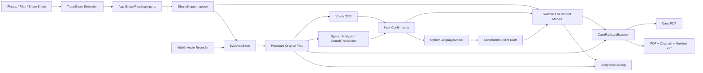

# 留痕 Trace：iOS 公開測試版工程規格書

> 文件版本：1.1
>
> 文件日期：2026-07-15
>
> 適用版本：External Beta Candidate
>
> Bundle ID：`tw.dayi.trace`
>
> Share Extension：`tw.dayi.trace.share`
>
> App Group：`group.tw.dayi.trace`

## 1. 規格目的

本文件定義留痕 iOS 公開測試版的資料模型、儲存不變量、核心流程、輸出格式、安全要求、錯誤處理及驗收條件。現有程式碼是實作起點；當現有行為與本規格衝突時，以本規格為修正目標。

## 2. 系統範圍

### P0 必須支援

- iOS 17 以上 iPhone。
- 手動文字事件記錄。
- Photos／Files／Share Extension 匯入。
- 圖片、PDF、音檔原始檔保存。
- App 內由使用者明確啟動的可見式錄音。
- 本機 OCR 與使用者確認。
- iOS 26 以上 SpeechAnalyzer／SpeechTranscriber 裝置端逐字稿。
- Foundation Models 結構化事件草稿與中性補問。
- 不支援語音轉錄或 Apple Intelligence 時的手動降級流程。
- 聊天截圖排序、人物映射及事件關聯。
- 多事件時間線。
- PDF 與完整 ZIP 案件包。
- Face ID／Touch ID／裝置密碼保護。
- App 切換器遮罩。
- 密碼加密備份與完整還原。
- 完整刪除與資料一致性檢查。

### P0 不支援

- 直接存取 LINE 或其他 App 的帳號與聊天資料庫。
- 隱蔽錄音、背景錄音或自動偷拍。
- 自動判斷霸凌、違法或申訴成功率。
- 自動判定截圖真偽或訊息實際發送時間。
- 自動送件給公司、政府、律師或合作機構。

### P1 後續能力

- StoreKit 付費案件包。
- 法規資訊來源對照。
- Private Cloud Compute 或其他伺服器模型。

External Beta 必須完成語音與 Apple Intelligence 實作；但事件建立、編輯、匯出與刪除不得依賴模型可用性。

## 3. 系統架構



### Targets

| Target | 職責 | 禁止事項 |
|---|---|---|
| `Trace` | UI、SwiftData、錄音、Speech、OCR、Foundation Models、案件包、備份 | 不直接讀取其他 App 私有資料 |
| `TraceShare` | 接收使用者分享的圖片並寫入 App Group | 不操作 SwiftData、不進行 OCR、不做長流程 |
| `Shared` | Share batch contract 與 App Group 路徑 | 不依賴 UIKit／SwiftData |

## 4. 資料不變量

以下規則是 P0 的最高優先級：

1. 原始附件建立後不可覆寫。
2. 原始事件陳述建立後不可覆寫。
3. 系統原始 OCR 建立後不可覆寫。
4. 修正內容建立新版本，不修改原始版本。
5. 每份衍生資料都能追溯其來源附件及來源版本。
6. 刪除操作必須涵蓋資料庫、原始檔、縮圖、OCR、匯出快取及備份暫存。
7. 匯出前重新驗證附件 SHA-256。
8. 未經使用者確認的 OCR、人物、日期與順序不得寫入正式事件摘要。
9. 原始語音辨識結果與使用者確認逐字稿分開保存。
10. AI 只讀取使用者已確認的文字，輸出另存為待確認草稿。
11. AI 草稿必須記錄來源 ID、prompt version、模型可用狀態與建立時間。

## 5. SwiftData Schema v2

採用 `VersionedSchema` 與 `SchemaMigrationPlan`。現有模型升級為以下資料結構。

### 5.1 `TraceEvent`

| 欄位 | 型別 | 規格 |
|---|---|---|
| `id` | UUID | 永久識別碼 |
| `title` | String | 使用者可修改，保留版本 |
| `occurredAtStart` | Date? | 可未知 |
| `occurredAtEnd` | Date? | 可未知 |
| `dateAccuracy` | enum | confirmed／estimated／unknown |
| `category` | enum | 中性工作事件分類 |
| `currentRevisionID` | UUID | 指向最新使用者確認版本 |
| `createdAt` | Date | 不可修改 |
| `updatedAt` | Date | 最新變更時間 |
| `deletedAt` | Date? | 刪除工作流內部使用，不作雲端同步 |

關聯：`revisions`、`attachments`、`conversationGroups`、`participants`。

### 5.2 `EventRevision`

| 欄位 | 型別 | 規格 |
|---|---|---|
| `id` | UUID | 版本識別碼 |
| `eventID` | UUID | 所屬事件 |
| `versionNumber` | Int | 從 1 遞增 |
| `source` | enum | original／userEdit／confirmedAI |
| `context` | String | 工作情境 |
| `narrative` | String | 事件敘述 |
| `workImpact` | String | 具體影響 |
| `uncertainties` | [String] | 不確定內容 |
| `createdAt` | Date | 不可修改 |

`versionNumber == 1` 為原始陳述，只能讀取。

### 5.3 `EvidenceAttachment`

| 欄位 | 型別 | 規格 |
|---|---|---|
| `id` | UUID | 附件識別碼 |
| `originalFileName` | String | 使用者提供或系統取得 |
| `storedRelativePath` | String | 不得包含使用者輸入的路徑 |
| `kind` | enum | image／pdf／audio／other |
| `uti` | String | 匯入時的 UTType |
| `byteCount` | Int64 | 原始大小 |
| `pixelWidth`／`pixelHeight` | Int? | 圖片適用 |
| `sha256AtImport` | String | 匯入完成時計算 |
| `integrityStatus` | enum | unverified／valid／mismatch／missing |
| `fileCreatedAt` | Date? | 檔案 metadata，不等於訊息時間 |
| `importedAt` | Date | App 收到內容的時間 |
| `sourceDescription` | String | 使用者提供 |
| `imageState` | enum | complete／cropped／annotated／masked／unknown |
| `eventID` | UUID? | 可稍後關聯 |
| `conversationGroupID` | UUID? | 聊天截圖適用 |
| `orderIndex` | Int | 同一群組中的順序 |

### 5.4 `OCRResult`

| 欄位 | 型別 | 規格 |
|---|---|---|
| `id` | UUID | OCR 執行識別碼 |
| `attachmentID` | UUID | 來源圖片 |
| `engine` | String | Vision API 與 revision |
| `localeIdentifiers` | [String] | 實際使用語言 |
| `rawText` | String | 唯讀 |
| `observations` | Data | Codable 文字、confidence、boundingBox |
| `createdAt` | Date | 執行時間 |
| `status` | enum | completed／empty／failed |

### 5.5 `ConfirmedTranscript`

| 欄位 | 型別 | 規格 |
|---|---|---|
| `id` | UUID | 確認版本 |
| `ocrResultID` | UUID | 來源 OCR |
| `text` | String | 使用者修正內容 |
| `confirmedAt` | Date | 確認時間 |
| `revisionNumber` | Int | 從 1 遞增 |

### 5.6 `ConversationGroup`

| 欄位 | 型別 | 規格 |
|---|---|---|
| `id` | UUID | 對話識別碼 |
| `sourceApp` | enum | LINE／Teams／Slack／Messenger／Email／other |
| `conversationType` | enum | direct／group／unknown |
| `displayedMessageTime` | String | 保留畫面原字串 |
| `userConfirmedDate` | Date? | 使用者確認或推估 |
| `dateAccuracy` | enum | confirmed／estimated／unknown |
| `createdAt` | Date | 建立時間 |

關聯：有序附件、參與人物、訊息草稿。

### 5.7 `ConversationParticipant`

| 欄位 | 型別 | 規格 |
|---|---|---|
| `id` | UUID | 人物識別碼 |
| `displayName` | String | 可為「左側人物 A」 |
| `role` | String? | 使用者自行填寫，不推測 |
| `isUser` | Bool | 本人映射 |
| `confirmationStatus` | enum | unconfirmed／confirmed |

### 5.8 `MessageSegment`

| 欄位 | 型別 | 規格 |
|---|---|---|
| `id` | UUID | 訊息識別碼 |
| `attachmentID` | UUID | 所在截圖 |
| `orderIndex` | Int | 對話順序 |
| `type` | enum | normal／quoted／system／attachment／unknown |
| `side` | enum | left／right／center／unknown |
| `participantID` | UUID? | 確認後對應 |
| `rawText` | String | OCR 草稿，不等於原始附件 |
| `confirmedText` | String? | 使用者確認內容 |
| `boundingBox` | CGRectCodable | 圖片座標 |
| `confirmationStatus` | enum | unconfirmed／confirmed |

### 5.9 `AudioRecordingSession`

| 欄位 | 型別 | 規格 |
|---|---|---|
| `id` | UUID | 錄音操作識別碼 |
| `attachmentID` | UUID? | 成功完成後對應原始音檔 |
| `startedAt` | Date | 使用者按下開始的時間 |
| `endedAt` | Date? | 停止或中斷完成的時間 |
| `duration` | TimeInterval | 實際音訊長度 |
| `status` | enum | preparing／recording／paused／finalizing／completed／failed |
| `interruptionLog` | Data | 中斷時間、原因與是否恢復；不得含音訊內容 |
| `routeDescription` | String? | 內建麥克風、耳機等非識別性路由 |
| `failureCode` | String? | 不包含檔案路徑或使用者內容 |

### 5.10 `SpeechTranscript`

| 欄位 | 型別 | 規格 |
|---|---|---|
| `id` | UUID | 逐字稿識別碼 |
| `attachmentID` | UUID | 來源音檔 |
| `engine` | enum | speechAnalyzer／manual |
| `localeIdentifier` | String | 實際使用語系 |
| `engineVersion` | String | OS 與 API 版本 |
| `rawText` | String | 系統原始結果，建立後唯讀 |
| `status` | enum | queued／processing／completed／cancelled／failed |
| `createdAt` | Date | 建立時間 |

關聯：有序 `SpeechSegment` 與多個 `ConfirmedTranscript` 修訂版本。

### 5.11 `SpeechSegment`

| 欄位 | 型別 | 規格 |
|---|---|---|
| `id` | UUID | 分段識別碼 |
| `transcriptID` | UUID | 所屬逐字稿 |
| `orderIndex` | Int | 分段順序 |
| `startTime` | TimeInterval | 相對於音檔起點 |
| `endTime` | TimeInterval | 相對於音檔起點 |
| `rawText` | String | 系統輸出 |
| `confirmedText` | String? | 使用者確認內容 |
| `confidence` | Double? | API 有提供時保存 |
| `confirmationStatus` | enum | unconfirmed／confirmed |

### 5.12 `IntelligenceDraft`

| 欄位 | 型別 | 規格 |
|---|---|---|
| `id` | UUID | 草稿識別碼 |
| `sourceRevisionIDs` | [UUID] | 已確認 OCR／逐字稿／事件修訂來源 |
| `promptVersion` | String | 例如 `event-structure.zh-TW.v1` |
| `modelFamily` | String | `SystemLanguageModel` |
| `modelOSVersion` | String | 產生時 OS 版本，供回歸追蹤 |
| `localeIdentifier` | String | 產生語言 |
| `structuredPayload` | Data | `EventDraft` 的 Codable 結果 |
| `status` | enum | generating／readyForReview／accepted／rejected／failed |
| `createdAt` | Date | 建立時間 |
| `reviewedAt` | Date? | 使用者接受或拒絕時間 |

接受草稿時建立新的 `EventRevision(source: .confirmedAI)`；不得覆寫來源 revision。

## 6. 檔案儲存規格

### 路徑

```text
Application Support/Trace/
├── Evidence/<attachment-id>/original.<ext>
├── Derived/<attachment-id>/thumbnail.jpg
├── Derived/<attachment-id>/ocr-<result-id>.json
├── Derived/<attachment-id>/speech-<transcript-id>.json
├── Derived/Intelligence/<draft-id>.json
├── Exports/<export-id>/
└── Staging/<operation-id>/
```

### 寫入流程

1. 寫入 `Staging/<operation-id>`。
2. 完成 fsync／close。
3. 計算 SHA-256 與 metadata。
4. 以原子 move 移至 Evidence 目錄。
5. 建立 SwiftData 紀錄。
6. 儲存失敗時移除 staging。

原始檔使用 `NSFileProtectionComplete`。檔名以 UUID 為主，不直接採用未清理的使用者檔名作為實體路徑。

## 7. Share Extension 規格

### 支援內容

- P0：最多 20 張圖片。
- 後續：PDF、URL 或純文字必須另行評估 activation rule。

### `PendingImportBatch` v2

```text
batchID
createdAt
sourceHostHint
items[]:
  itemID
  orderIndex
  originalFileName
  storedFileName
  uti
  byteCount
  sha256
```

### 要求

- `orderIndex` 在建立 Task 前固定，完成順序不得改變結果順序。
- 先保存全部檔案，再原子寫入 `manifest.json`。
- manifest 是 batch 完成標記；沒有 manifest 的資料夾視為中斷暫存。
- 主 App 成功複製、驗證雜湊並建立資料模型後才刪除 batch。
- 同一 `batchID` 重試不得建立重複附件。
- Extension 不執行 OCR、不開啟主 App、不存 SwiftData。

## 8. OCR 與聊天整理流程

### OCR

1. 檢查原始檔存在並核對 SHA-256。
2. 使用 Vision accurate recognition。
3. 保存每段文字、confidence 與 bounding box。
4. 建立唯讀 `OCRResult`。
5. 依 y 軸與 x 軸建立候選訊息順序。
6. 顯示使用者確認介面。

### 人物映射

- 未確認前只顯示左側、右側、系統訊息。
- 首次詢問「右側訊息是否為你本人？」。
- 不以版面位置自動推定主管或同事。
- 人物角色由使用者輸入，允許不知道或稍後補充。

### 正式寫入

只有以下資料可進入案件摘要：

- 使用者已確認的 transcript。
- 使用者已確認的人物映射。
- 使用者已確認或標記為推估的日期。
- 使用者主動建立的事件關聯。

## 9. 語音錄音與逐字稿規格

### 錄音模式

- 錄音只能由使用者在 App 內明確按下開始。
- 錄音期間持續顯示紅色狀態、經過時間、暫停與停止按鈕。
- P0 不宣告背景音訊模式；App 離開 active 狀態時暫停並安全完成目前檔案。
- 不提供遠端啟動、排程啟動、音量鍵暗號、偽裝畫面或隱藏錄音指示。
- 首次使用前顯示用途與所在地錄音規範提醒，但不由 App 判斷使用是否合法。

### 音訊儲存

- 使用 `AVAudioSession` 與 `AVAudioRecorder`，由 `AudioRecorderService` 統一管理狀態。
- 建議格式為 MPEG-4 AAC／`.m4a`、單聲道，取樣率跟隨硬體可用的 44.1 或 48 kHz。
- 錄音先寫入 Staging；停止、close、雜湊與原子移動完成後才建立 `EvidenceAttachment`。
- 完成後的音檔視為原始附件，不重新壓縮、不裁切、不覆寫。
- 保存開始、結束、長度、檔案大小、路由、中斷紀錄、匯入時間與 SHA-256。
- `Info.plist` 必須提供清楚的 `NSMicrophoneUsageDescription`。

### 生命週期與中斷

1. 權限及可用空間檢查。
2. 建立 `AudioRecordingSession(status: .preparing)` 與 staging 檔。
3. 啟動 audio session 後切換為 `.recording`。
4. 暫停、來電、Siri、耳機拔除或 route change 均寫入不中斷原檔的操作紀錄。
5. 停止後進入 `.finalizing`，完成 close、duration、SHA-256 與原子移動。
6. 僅在所有步驟成功後標為 `.completed`；失敗需保留可復原檔或明示待清理。

### SpeechAnalyzer／SpeechTranscriber

- 以 `@available(iOS 26.0, *)` 隔離新 API，App deployment target 維持 iOS 17。
- 先檢查 `SpeechTranscriber.isAvailable`，再以 `supportedLocale(equivalentTo:)` 檢查語系，最後透過 `AssetInventory` 確認或下載必要資產。
- 既有音檔使用 `SpeechAnalyzer` 的檔案分析流程；分析輸出以 `AsyncSequence` 消費並支援取消。
- 原始結果、時間分段與 confidence 建立後唯讀；修改寫入 `ConfirmedTranscript`／`SpeechSegment.confirmedText`。
- 每次重跑建立新的 `SpeechTranscript`，不得覆蓋舊結果。
- iOS 17～25、語系不支援、資產未就緒或使用者拒絕權限時，保留音檔並提供手動事件問答；External Beta 不呼叫雲端 Speech 或第三方轉錄服務。
- `Info.plist` 必須提供 `NSSpeechRecognitionUsageDescription`，並在介面說明轉錄可用性及資產狀態。

## 10. Apple Intelligence 規格

### 模型與可用性

- External Beta 僅使用 Foundation Models 的 `SystemLanguageModel.default`；不啟用 Private Cloud Compute 或第三方模型。
- 以 `@available(iOS 26.0, *)` 隔離 Foundation Models，並在建立 session 前檢查 `availability` 與 `supportsLocale(_:)`。
- UI 必須區分：available、deviceNotEligible、modelNotReady、Apple Intelligence 未開啟、語言不支援及未知錯誤。
- 模型不可用時顯示相同欄位的固定問答表單，不阻擋事件建立、匯出、備份或刪除。

### 輸入邊界

- 只允許使用者已確認的 OCR、逐字稿及事件 revision 作為模型輸入。
- 原始圖片、音檔、未確認 OCR、聯絡人資料與其他 App 資料不得直接送入模型。
- 來源文字放在 prompt，不插入 developer instructions，降低來源文字中的 prompt injection 影響。
- 指示固定要求中性、可追溯、不推測動機、不判定霸凌或違法、不提供成功率。
- 長內容先依事件與時間分段；使用模型的 token count／context size 能力預先阻止超限，不能靜默截斷來源。

### Guided Generation 輸出

使用 `@Generable` 與 `@Guide` 產生型別安全的 `EventDraft`：

```swift
@Generable
struct EventDraft {
    var neutralTitle: String
    var involvedPeople: [String]
    var timeDescription: String?
    var concreteActions: [String]
    var workImpact: [String]
    var uncertainties: [String]
    @Guide(description: "0 到 3 個中性補問")
    var followUpQuestions: [String]
    var sourceReferences: [String]
}
```

實作時 `sourceReferences` 必須由 App 以來源 ID 驗證，不可只信任模型產生的字串。

### 審閱與寫入

1. 產生前顯示將使用的來源項目，由使用者確認。
2. 以 streaming snapshot 顯示進度，但 partial output 不寫入事件。
3. 完整結果保存為 `IntelligenceDraft(status: .readyForReview)`。
4. UI 逐欄顯示來源、接受、修改與拒絕操作。
5. 只有使用者確認後建立 `EventRevision(source: .confirmedAI)`。
6. 拒絕或生成失敗不得改動來源附件、逐字稿或事件。

### Prompt 與品質管理

- Prompt 使用語系與版本命名，例如 `event-structure.zh-TW.v1`。
- 保存 prompt version、OS version、locale、輸入來源 ID、結果狀態與耗時；不得在診斷紀錄保存實際文字。
- 每個支援 OS 模型版本以匿名 fixture 執行準確度、臆測、缺漏與語氣回歸測試。
- guardrail violation、unsupported language、context exceeded、資源不足及使用者取消都要有可理解的降級介面。
- 法規對照只能使用日後建立的版本化可信來源；模型自身知識不得當作法規引用。

## 11. 完整刪除規格

### 刪除附件

1. 建立 delete operation。
2. 列出原始檔、縮圖、OCR、逐字稿、AI 草稿、匯出快取與資料模型。
3. 先將實體檔 move 至 operation trash。
4. 刪除 SwiftData 關聯。
5. 儲存 model context。
6. 刪除 operation trash。
7. 任一步失敗則回復或顯示待清理狀態。

### 刪除事件

- 套用附件刪除流程至全部關聯附件。
- 刪除 revisions、conversation groups、participants、message segments、speech transcripts、speech segments 與 intelligence drafts。
- 若附件被其他事件引用，必須先解除該事件關聯，不刪除原檔。
- UI 只在所有步驟完成後顯示「已刪除」。

### 完整刪除驗收

- 資料庫查詢為零。
- Evidence／Derived／Exports／Staging 無相關 ID。
- 重啟 App 後資料不會重新出現。
- 備份是使用者自行保存的外部副本，刪除本機資料時需明確提示不會刪除外部備份。

## 12. App Lock 與隱私遮罩

- 使用 `.deviceOwnerAuthentication`，允許生物辨識與裝置密碼。
- App 進入 inactive 時立即以無敏感內容的遮罩覆蓋。
- App 進入 background 且鎖定啟用時，將 session 標為 locked。
- 回到 active 時先顯示遮罩，再執行驗證。
- 驗證失敗、取消或 system cancel 不顯示資料。
- 鎖定設定可以保存在 UserDefaults；事件內容與密碼不得保存於 UserDefaults。

## 13. 加密備份規格

### Envelope v1

- JSON envelope。
- PBKDF2-HMAC-SHA256。
- 隨機 16-byte salt。
- 最低 210,000 iterations；正式發布前需安全審查與效能量測。
- AES-256-GCM combined nonce、ciphertext、tag。
- 包含 format version、建立時間與 KDF 參數。

### 內容

- SwiftData 可還原資料。
- 原始附件 bytes。
- 逐字稿、確認版本與 AI 草稿；均保留來源關聯。
- 原始 SHA-256。
- schema version。
- 不包含備份密碼。

### 還原

- 在 staging 解密及驗證完整內容。
- 全部附件核對 SHA-256 後才寫入正式目錄。
- 以 transaction 匯入；失敗不得留下部分事件。
- 預設新增，不覆蓋現有事件。
- 相同 backup ID 重複匯入時顯示警告。
- KDF 與大附件處理不得阻塞 MainActor。

## 14. 案件包輸出規格

### PDF

1. 封面及產製聲明。
2. 一頁案件總覽。
3. 多事件時間線。
4. 每件事件詳情。
5. 對話附件頁：縮圖、時間狀態、OCR 確認稿、人物映射。
6. 語音附件頁：音檔 metadata、時間分段及使用者確認逐字稿。
7. AI 協助內容清楚標示 prompt version、產生時間與使用者確認狀態。
8. 附件索引。
9. 尚未確認與使用者標記為推估的內容。

### ZIP

```text
Trace-Case-<export-id>.zip
├── 留痕案件包.pdf
├── attachments/
│   ├── E-001-original.png
│   └── E-002-original.pdf
└── manifest.json
```

### `manifest.json`

- export ID 與時間。
- App／schema／format version。
- 事件 ID 與附件編號映射。
- 每個檔案的相對路徑、byte count、SHA-256、匯入時間與來源說明。
- PDF 自身 SHA-256。
- 產製聲明版本。

### 產製聲明

> 本文件為使用者提供資料的整理結果，不構成法律意見、職場霸凌判定、截圖真偽認證或證據能力保證。

## 15. UI 規格

### 首頁：溫和留痕

- 顯示最近事件與材料確認狀態。
- 主要 CTA：「加入一段工作對話」。
- 空狀態不使用法律術語或焦慮式文案。

### 對話整理

- 多圖底部縮圖列與拖曳排序。
- 主畫面顯示原圖及 OCR bounding boxes。
- 每段訊息可設定類型、人物及確認文字。
- 顯示尚未確認數量，但不提供證據分數。

### 語音記錄

- 首頁提供「開始語音記錄」與「匯入音檔」，兩者清楚區分。
- 錄音畫面固定顯示狀態、經過時間、暫停與停止；不以裝飾動畫取代文字狀態。
- 停止後先顯示「原始音檔已保存」，再提供開始轉錄。
- 逐字稿以時間分段顯示，可播放對應片段、修正與逐段確認。

### Apple Intelligence 整理

- 入口名稱為「協助整理」，不使用「判斷霸凌」或「法律分析」。
- 產生前列出來源，產生後逐欄顯示來源引用及確認控制。
- 模型不可用時同頁切換固定問答，不把功能藏起來或只顯示錯誤碼。
- AI 產生、使用者修改與最終確認使用不同視覺狀態。

### 事件詳情：案件編目

- 原始陳述唯讀。
- 使用「新增修正版」操作，不直接編輯原文。
- 顯示 revision、附件、對話與不確定事項。
- PDF／案件包入口在資料確認後仍可使用，但需標示未確認內容。

### 隱私：私密保險箱

- App Lock 狀態。
- 最後備份時間。
- 完整性檢查。
- 完整刪除入口。
- 清楚區分 App 資料、案件匯出與外部備份。

## 16. 錯誤處理

所有使用者可見錯誤需包含：

- 發生什麼事。
- 哪些資料已保存。
- 哪些資料尚未完成。
- 可採取的下一步。

禁止只顯示「操作失敗」。錯誤不得包含原始事件內容、OCR、逐字稿、AI 輸入輸出或檔案路徑。

語音及模型錯誤至少涵蓋：麥克風權限、錄音中斷、儲存空間、語系不支援、Speech 資產未就緒、裝置不支援 Apple Intelligence、模型未就緒、guardrail、context exceeded 與使用者取消。

關鍵 operation 使用持久化狀態：pending／running／completed／needsCleanup／failed。

## 17. 測試規格

### Unit Tests

| ID | 測試 |
|---|---|
| UT-DATA-001 | 原始 revision 建立後不可修改 |
| UT-DATA-002 | 新修訂版本遞增且可追溯 |
| UT-FILE-001 | 匯入前後 SHA-256 一致 |
| UT-FILE-002 | 修改檔案後 integrityStatus 為 mismatch |
| UT-DELETE-001 | 刪除附件移除所有衍生檔 |
| UT-DELETE-002 | 刪除事件不留 orphan files |
| UT-SHARE-001 | 非同步載入後仍保留 orderIndex |
| UT-SHARE-002 | 相同 batch 重試不重複匯入 |
| UT-AUDIO-001 | 完成錄音後檔案 close、雜湊與 attachment 一致 |
| UT-AUDIO-002 | 中斷或失敗後可復原或列為待清理，不遺失狀態 |
| UT-SPEECH-001 | 原始逐字稿不可修改且確認稿可建立新版本 |
| UT-SPEECH-002 | 不支援語系或資產未就緒正確降級 |
| UT-AI-001 | 模型輸入只包含 confirmed source IDs |
| UT-AI-002 | 接受草稿建立新 revision，拒絕不改動來源 |
| UT-AI-003 | availability、guardrail 與 context exceeded 映射正確狀態 |
| UT-BACKUP-001 | 備份→還原後逐檔雜湊相同 |
| UT-BACKUP-002 | 錯誤密碼不寫入任何資料 |
| UT-EXPORT-001 | PDF 與 manifest 附件編號一致 |
| UT-EXPORT-002 | ZIP 內每個 SHA-256 可重新驗證 |

### UI Tests

| ID | 流程 |
|---|---|
| UI-001 | 建立事件並保存原始陳述 |
| UI-002 | 匯入多張截圖並調整順序 |
| UI-003 | 執行 OCR、修正文字並確認人物 |
| UI-004 | 關聯既有事件並產生 PDF |
| UI-005 | 建立備份、刪除本機、完整還原 |
| UI-006 | App 進入背景時遮罩敏感內容 |
| UI-007 | 開始、暫停、繼續及停止錄音後保存原始音檔 |
| UI-008 | 轉錄音檔、播放分段並確認逐字稿 |
| UI-009 | 產生、修改、接受或拒絕 AI 事件草稿 |
| UI-010 | 不支援 Apple Intelligence 時完成固定問答降級流程 |

### Fixture

- 不含真實個資的 LINE、Teams、Email 測試截圖。
- 繁體中文、英文、數字、日期、引用與收回訊息。
- 裁切、標註、遮罩、長圖與重複區段。
- 空白圖片、損壞檔、大型附件與低儲存空間。
- 短語音、長語音、靜音、背景噪音、多人重疊與中斷音檔。
- 匿名化的正常、缺漏、矛盾、誘導及 prompt injection 測試文字。

## 18. 無障礙與本地化

- 所有操作有 VoiceOver label／hint。
- 不只以顏色表示確認狀態。
- 支援 Dynamic Type；主要流程在最大 accessibility size 不截斷操作。
- 最小可點擊區域 44×44 pt。
- 首版介面為繁體中文，所有字串移入 String Catalog。
- 日期顯示使用 Locale，資料保存使用 Date 與明確 accuracy。
- VoiceOver 必須能讀出錄音中、已暫停、轉錄進度及 AI 草稿確認狀態。

## 19. 診斷與回饋

- 預設不使用第三方追蹤 SDK。
- 不記錄事件文字、OCR、逐字稿、AI prompt／response、姓名、檔名、SHA-256 或附件內容。
- 診斷只包含 App version、iOS version、裝置類型、功能步驟與匿名錯誤碼。
- 使用者主動按下「匯出診斷」才產生檔案，分享前可預覽。
- 回饋表單需提醒不要貼入公司機密或未遮罩個資。

## 20. 發布設定

- `MARKETING_VERSION` 與 `CURRENT_PROJECT_VERSION` 由 CI／Release 流程管理。
- 語音與 Foundation Models 開發、CI 編譯及 archive 使用 Xcode 26 以上；deployment target 保持 iOS 17。
- 新 API 放在 availability-isolated service，iOS 17～25 不得在啟動或連結階段崩潰。
- `Info.plist` 完成麥克風與語音辨識用途說明，文字需與實際行為一致。
- Debug 可使用測試資料；Release 不含任何真實案例或預設附件。
- TestFlight Release Notes 列出資料風險與已知限制。
- App Store Connect 隱私標籤需與實際 SDK、資料行為一致。
- External Beta 前完成 App Group、兩 target provisioning 與真機 smoke test。

## 21. 驗收追蹤

| 規格群組 | 公開測試 Gate |
|---|---|
| DATA | 原始資料唯讀、修訂可追溯 |
| DELETE | 資料庫與檔案完整刪除 |
| CHAT | 多圖順序、人物、日期及事件關聯 |
| AUDIO | 可見式錄音、中斷處理、原始檔保存與完整刪除 |
| SPEECH | SpeechAnalyzer 逐字稿、分段、確認版本與降級 |
| INTELLIGENCE | availability、guided draft、來源追溯、確認與 prompt 回歸 |
| EXPORT | 多事件 PDF／ZIP／manifest 一致 |
| PRIVACY | App Switcher 遮罩與裝置驗證 |
| BACKUP | 往返、損壞、錯密碼與中斷測試 |
| SIGNING | App Group 與 Share Extension 真機通過 |
| LEGAL | 隱私政策、測試條款與產製聲明 |
| QA | CI、unit、UI、fixture 與 smoke tests 通過 |

## 22. Apple 官方技術依據

- [SpeechAnalyzer](https://developer.apple.com/documentation/speech/speechanalyzer)
- [SpeechTranscriber](https://developer.apple.com/documentation/speech/speechtranscriber)
- [AssetInventory](https://developer.apple.com/documentation/speech/assetinventory)
- [SystemLanguageModel](https://developer.apple.com/documentation/foundationmodels/systemlanguagemodel)
- [Foundation Models framework](https://developer.apple.com/documentation/foundationmodels/)
- [Meet the Foundation Models framework](https://developer.apple.com/videos/play/wwdc2025/286/)
